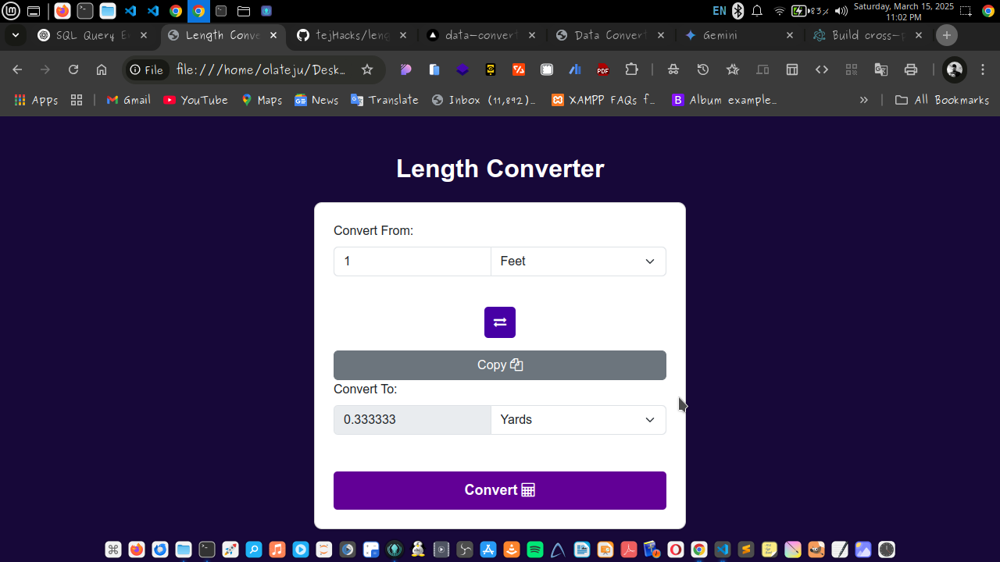

# Length Converter

## Overview
The **Length Converter** is a simple web application that allows users to convert between different units of length, including millimeters, centimeters, meters, kilometers, inches, feet, yards, and miles. The tool provides an intuitive interface with Bootstrap styling, and it includes functionalities such as unit swapping and result copying.

## Features
- **Instant Length Conversion**: Converts values between different length units.
- **Unit Swapping**: Quickly switch between input and output units.
- **Clipboard Copying**: Easily copy the conversion result.
- **Responsive Design**: Works on desktop and mobile devices using Bootstrap.

## Supported Units
- Millimeters (mm)
- Centimeters (cm)
- Meters (m)
- Kilometers (km)
- Inches (in)
- Feet (ft)
- Yards (yd)
- Miles (mi)

## How to Use
1. Enter a value in the input field.
2. Select the **from unit** (the unit of the input value).
3. Select the **to unit** (the unit you want to convert to).
4. Click the **Convert** button to see the result.
5. Use the **Swap** button to switch between units.
6. Click the **Copy** button to copy the result to your clipboard.

## Installation & Deployment
To use this tool:
1. Download or clone the repository.
2. Open the `index.html` file in a web browser.

## Screenshot

## Technologies Used
- HTML
- CSS (Bootstrap for styling)
- JavaScript (for conversion logic)

## Future Improvements
- Add more units (e.g., nautical miles, micrometers, nanometers)
- Implement real-time conversion without a button click
- Dark mode for better usability

---

Enjoy using the Length Converter! 🚀

